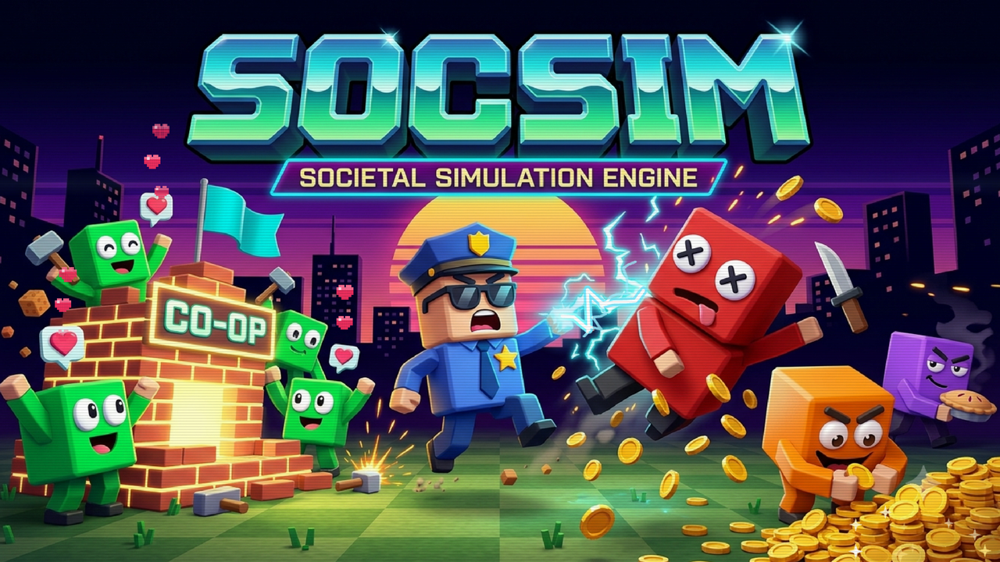
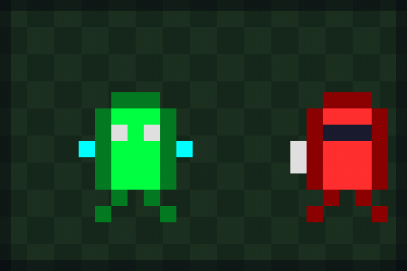
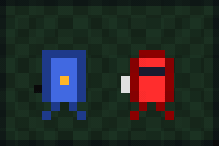
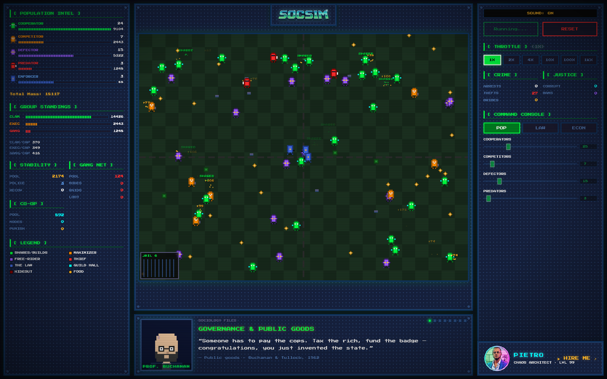
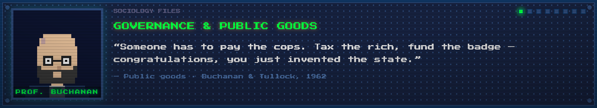
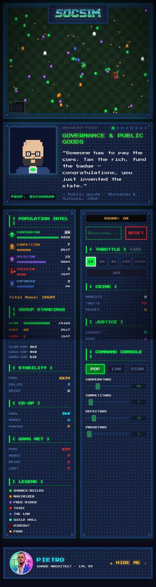

<div align="center">



# SOCSIM

**A tiny pixel civilization that keeps reinventing the state, then complaining about the taxes.**

</div>

Boot it like a 1997 strategy game you found in a dusty CD wallet. Press a key, and a few hundred square creatures wake up and start doing what creatures do. They share food. They free-ride. They mug each other in broad daylight. They fund a police force they openly resent, and they sort themselves into a wealth curve nobody voted for.

You don't manage them. You set the opening conditions and the funding rules, then watch a society argue with itself in real time. Nobody tells these things to build a government. They build one anyway, usually right before they start dodging it.

Under the chunky sprites and the CRT glow it's a genuine agent-based model. The simulation logic is the same engine from v0.3. Version 0.4 is the part where it stopped looking like a research notebook and started looking like something with a high-score screen.

## The cast

Five behaviors, five colors, one shared map, and a strictly finite amount of food. Everything after that is emergent, which is the academic way of saying that nobody planned for it to go like this.

| Faction | Color | What it actually does |
| :-- | :-- | :-- |
| **Cooperator** | Green | Shares food and chips in for the guild hall. Eats a personal penalty so the group stays standing. Believes, against mounting evidence, that everyone else will pitch in too. |
| **Competitor** | Orange | Grows its own pile and stops thinking there. Quite content to stand inside a police perimeter it never paid a cent toward. |
| **Defector** | Purple | Enjoys the upside of cooperation and skips the invoice. The group keeps receipts. Eventually the group stops returning its calls. |
| **Predator** | Red | Takes mass straight off other bodies. Builds hideouts. Occasionally leaves the map in the back of a van. |
| **Enforcer** | Blue | Paid out of taxes to chase predators and raid hideouts. The nearest thing this world has to a government, and roughly as beloved. |

There are also co-op nodes, which are club goods with a bouncer, and predator hideouts, which are organized crime run as a real-estate play. The food pellets scattered around the map are what the entire drama is actually about.

## Field footage

Three things this world does on its own, every single run, no prompting required.

<div align="center">
<table>
<tr>
<td align="center" width="33%"><br><sub><b>Redistribution, informal sector</b></sub></td>
<td align="center" width="33%"><br><sub><b>Deterrence</b></sub></td>
<td align="center" width="33%"><br><sub><b>Due process, abridged</b></sub></td>
</tr>
</table>
</div>

On the left, a predator takes mass directly off a cooperator. Do that a few thousand times across a map and you get Pareto's eighty-twenty split with no spreadsheet involved. In the middle, an enforcer reminds a predator that crime is a math problem, which was Becker's entire point: if you want less of it, you make the odds worse, not the speeches longer. On the right, a hideout that was booming right up until the van showed up.

## The dashboard

<div align="center">

</div>

Left panel is the intel feed: live faction counts, mass bars, system stability, the predator network, how much reciprocity is left in the tank. Right panel is the command console, where sixteen sliders let you change the rules and then live with the consequences. The center is the city, drawn one chunky sprite at a time, complete with guild halls, hideouts, the occasional arrest, and a jail counter that ticks up faster than you'd hope.

## The sociology files

<div align="center">

</div>

Every few seconds a scholar walks on to explain, in one sentence, the exact mess currently happening on screen. Buchanan on why someone has to pay the cops. Olson on why the guild hall needs a bouncer. Axelrod on keeping receipts. Pareto on why the map was never going to be fair. They come with pixel beards, questionable eyewear, and real citations, because the joke lands harder when it's load-bearing.

## It runs on your phone too

<div align="center">

</div>

The board sits up top, the panels stack underneath, and the whole society fits in your hand. Same engine, smaller riots.

## What's in the box

- Animated pixel sprites with directional walk cycles and a flash for every state change
- Particle work for the moments that matter: blood splashes, arrests, zaps, shared meals, coin pops, raid sirens, the lot
- A live intel HUD reading out counts, mass, stability, investment, and how much trust the colony has left
- A tabbed console with sixteen sliders, speed control from 1x up to 1000x, an 8-bit boot sequence, and sound you can switch off when the office gets quiet
- Pure vanilla JavaScript and Canvas. No build step, no framework, no dependency tree to apologize for

## Run it

1. Grab the repo, keeping the files together.
2. Open `index.htm` in a browser. Chrome behaves best.
3. Press any key to clear the title screen, push a few sliders, then start the simulation and let it cook.

That's the whole setup. There's nothing to install and nothing to sign up for.

## Repo structure

```
SocSim/
├── index.htm            layout and DOM
├── style.css            the retro pixel skin
├── v04.js               the ABM engine and the render layer
├── splash-render.js     title-screen FX overlay
├── mask-data.js         splash sheen mask data
├── assets/              splash art, logo, sprites
└── README.md
```

## Status

Stable. The simulation is frozen from v0.3 and behaves itself. Version 0.4 is the presentation layer: the pixel art, the sound, the splash, and a layout that finally holds still on a phone.

## Who built this


Pietro. Chaos architect, level 99. I build small worlds to find out what they do when no one is steering, then dress them up like arcade cabinets so the findings go down easier. SOCSIM is a side project with a serious streak: a sandbox for watching cooperation, crime, and inequality fall out of a handful of plain rules.

If you want to talk simulations, emergent systems, or why your pixel society keeps inventing a mafia, find me on [LinkedIn](https://www.linkedin.com/in/pietro-works).

<br clear="left">

## License

MIT. Take it apart, run your own experiments, and see what your colony reinvents.
